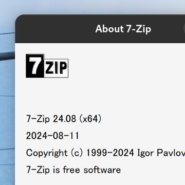
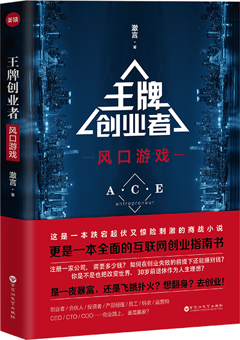
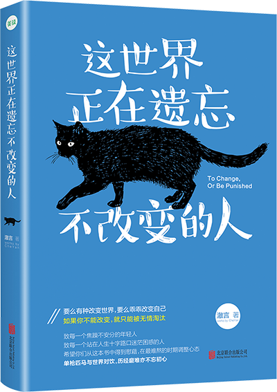
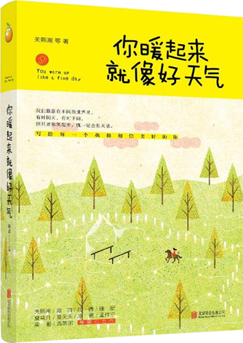
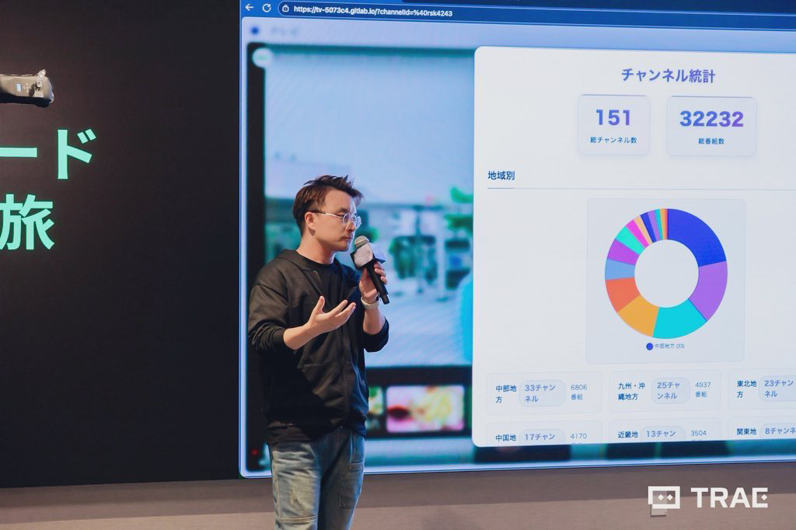

  
    
  <h2>
    
     
    
  </h2>

<!-- GitHub 统计卡片 -->

  
  

<!-- GitHub 连续打卡 -->

  

<!-- GitHub 活动统计图 -->

  

<!-- GitHub 资料奖杯 -->

  

<!-- 贪吃蛇动画 -->

  <picture>
    <source media="(prefers-color-scheme: dark)" srcset="https://raw.githubusercontent.com/iamcheyan/iamcheyan/output/github-contribution-grid-snake-dark.svg">
    <source media="(prefers-color-scheme: light)" srcset="https://raw.githubusercontent.com/iamcheyan/iamcheyan/output/github-contribution-grid-snake.svg">
    
  </picture>

---

## 👋 关于我 / 私について

  
    
  <h2>
    
     
    
  </h2>

**2009年からフルスタック開発に従事し、Python（Flask・PyWebIO・Streamlit）、JavaScript（ES6+）、MySQLなどの技術スタックを活用してまいりました。2014年に起業し、投資を獲得した経験があります。チームマネジメントやプロジェクト実行の豊富な経験を持ち、書籍出版や映像作品の脚本・制作にも携わるなど、多分野での協働経験を積んでまいりました。**

**自2009年起从事全栈开发，擅长使用 Python（Flask・PyWebIO・Streamlit）、JavaScript（ES6+）、MySQL 等技术栈。2014年创业并获得投资。拥有丰富的团队管理和项目执行经验，并参与书籍出版和影视作品的剧本创作与制作，积累了多领域的协作经验。**

 

<table>
<tr>
<td width="33%" valign="top" align="center">

🔭 **現在の仕事 / 当前工作**

  

フルスタック開発 
書籍執筆 
脚本制作

</td>
<td width="33%" valign="top" align="center">

🌱 **学習中 / 正在学习**

  

日本語 
自然言語処理 
映像制作

</td>
<td width="33%" valign="top" align="center">

💼 **経験 / 经验**

  

2009年から開発開始 
2014年創業・投資獲得

</td>
</tr>
<tr>
<td width="50%" valign="top" align="center">

📚 **出版 / 出版**

  

複数の書籍を出版 
映像作品の脚本・制作に携わる

</td>
<td width="50%" valign="top" align="center">

🎬 **映像作品 / 影视作品**

  

ドラマ・映画・ショートドラマ 
脚本・企画・制作

</td>
</tr>
</table>

---

## 🛠️ 技术栈 / 技術スタック

### 💻 编程语言 / プログラミング言語

  

### 🐍 Python 框架 / Pythonフレームワーク

  

### 🎨 前端技术 / フロントエンド技術

  

### 🗄️ 数据库 / データベース

  

### 🛠️ 工具和平台 / ツールとプラットフォーム

---

## 📊 GitHub 统计 / GitHub統計

### 🎮 修仙系列统计卡片

---

## 🚀 プロジェクト / 项目

### ⭐ 主要プロジェクト / 主要项目

 

<table>
<tr>
<td width="50%" valign="top">

#### 🎓 [Fudoki](https://fudoki.iamcheyan.com/) (2025)

<strong>日本語学習者や自然言語処理研究者向けの日本語テキスト分析ツール</strong> 
面向日语学习者和自然语言处理研究者的日语文本分析工具

</td>
<td width="50%" valign="top">

#### 📺 [Terebi](https://terebi.iamcheyan.com/) (2025)

<strong>日本全国100以上のテレビ局の公開番組をオンラインで視聴可能</strong> 
可在线观看日本全国100多个电视台的公开节目

</td>
</tr>
<tr>
<td width="50%" valign="top">

#### 📚 [Kotoba](https://kotoba.iamcheyan.com/) (2024)

<strong>オンライン日本語単語暗記ツール</strong> 
在线日语单词记忆工具

</td>
<td width="50%" valign="top">

#### 🐧 [7z-for-Linux](https://github.com/iamcheyan/7z-for-Linux) (2024)

<strong>7z圧縮ソフトをLinuxに移植</strong> 
将7z压缩软件移植到Linux

</td>
</tr>
</table>

 

### 🌟 その他のプロジェクト / 其他项目

 

<table>
<tr>
<td width="33%" valign="top" align="center">

#### 🎨 [OrchideaDock](https://cinnamon-spices.linuxmint.com/themes/view/OrchideaDock) (2023)

<strong>システムテーマ</strong> 
系统主题

</td>
<td width="33%" valign="top" align="center">

#### 📊 YRBOOK BAS (2021)

<strong>データ分析ツール</strong> 
数据分析工具

</td>
<td width="33%" valign="top" align="center">

#### 🎮 [Mir2EI2.0](https://iamcheyan.com/app/mir/) (2021)

<strong>クラシックゲーム</strong> 
经典游戏

</td>
</tr>
<tr>
<td width="33%" valign="top" align="center">

#### 🏢 [wenyue.cn](https://wenyue.cn/) (2014)

<strong>フォント設計・開発</strong> 
字体设计开发

</td>
<td width="33%" valign="top" align="center">

#### 💼 [GANLINE Olive Media](https://iamcheyan.com/app/ganline/index.html) (2012)

<strong>ウェブサイト設計</strong> 
网站设计

</td>
<td width="33%" valign="top" align="center">

#### 📖 [VEIKIN](https://iamcheyan.com/app/veikin/) (2007)

<strong>電子雑誌</strong> 
电子杂志

</td>
</tr>
</table>

---

## 📚 出版物 / 出版物

### ✍️ 個人作品 / 个人作品

 

<table>
<tr>
<td width="33%" valign="top" align="center">

  

<strong><a href="https://www.books.com.tw/products/0010885446" style="color: white;">他人の地図では自分の道は見つからない</a></strong>

 

<small style="color: #f0f0f0;">2020年4月</small> 
<small style="color: #f0f0f0;">台湾ムーグァン文化有限公司</small> 
<small style="color: #f0f0f0;">ISBN: 9789869942508</small>

</td>
<td width="33%" valign="top" align="center">

  

<strong><a href="https://book.douban.com/subject/35216411/" style="color: white;">ブロックチェーン風雲</a></strong>

 

<small style="color: #f0f0f0;">2020年10月</small> 
<small style="color: #f0f0f0;">遼寧人民出版社</small> 
<small style="color: #f0f0f0;">ISBN: 9787205099527</small>

</td>
<td width="33%" valign="top" align="center">

  

<strong><a href="https://book.douban.com/subject/30336323/" style="color: white;">人生の苦しみを嘆くな、それは世界を見る道だ</a></strong>

 

<small style="color: #f0f0f0;">2018年11月</small> 
<small style="color: #f0f0f0;">江蘇鳳凰文芸出版社</small> 
<small style="color: #f0f0f0;">ISBN: 9787559429100</small>

</td>
</tr>
<tr>
<td width="33%" valign="top" align="center">

  

<strong><a href="https://book.douban.com/subject/27592545/" style="color: #333;">エース起業家：風口ゲーム</a></strong>

 

<small style="color: #555;">2018年2月</small> 
<small style="color: #555;">百花洲文芸出版社</small> 
<small style="color: #555;">ISBN: 9787550025387</small>

</td>
<td width="33%" valign="top" align="center">

  

<strong><a href="https://book.douban.com/subject/27031444/" style="color: white;">この世界は変わらない人を忘れていく</a></strong>

 

<small style="color: #f0f0f0;">2017年5月</small> 
<small style="color: #f0f0f0;">北京連合出版公司</small> 
<small style="color: #f0f0f0;">ISBN: 9787559602404</small>

</td>
</tr>
</table>

### 🤝 共著作品 / 合著作品

 

<table>
<tr>
<td width="50%" valign="top" align="center">

  

<strong><a href="https://book.douban.com/subject/30242395/" style="color: #333;">世界はあなたのような人を罰している</a></strong>

 

<small style="color: #555;">2018年3月</small> 
<small style="color: #555;">中国法制出版社</small> 
<small style="color: #555;">ISBN: 9787509391037</small> 
<small style="color: #555;">李尚龍らと共著、夜読公式アカウント発行</small>

</td>
<td width="50%" valign="top" align="center">

  

<strong><a href="https://book.douban.com/subject/30336323/" style="color: #333;">あなたが温かくなると天気も良くなる</a></strong>

 

<small style="color: #555;">2017年10月</small> 
<small style="color: #555;">江蘇鳳凰文芸出版社</small> 
<small style="color: #555;">ISBN: 9787559409898</small> 
<small style="color: #555;">関熙潮らと共著、美読公式アカウント発行</small>

</td>
</tr>
</table>

---

## 🎬 映像作品 / 影视作品

### 📺 ドラマ / 电视剧

 

<table>
<tr>
<td width="33%" valign="top" align="center">

  

<strong><a href="https://movie.douban.com/subject/35196859/">劉老根5</a></strong>

 

<small>(2022)</small> 
<small>主演：趙本山 / 宋小宝 / 程野 / 閻学晶</small> 
<strong style="color: #4ECDC4;">脚本助手</strong>

</td>
<td width="33%" valign="top" align="center">

  

<strong><a href="https://movie.douban.com/subject/35196859/">劉老根4</a></strong>

 

<small>(2021)</small> 
<small>主演：趙本山 / 宋小宝 / 范偉 / 閻学晶</small> 
<strong style="color: #FF6B6B;">ストーリー企画</strong>

</td>
<td width="33%" valign="top" align="center">

  

<strong><a href="https://movie.douban.com/subject/33437298/">劉老根3</a></strong>

 

<small>(2020)</small> 
<small>主演：趙本山 / 范偉 / 閻学晶</small> 
<strong style="color: #4ECDC4;">ストーリー企画</strong>

</td>
</tr>
</table>

### 🎞️ 映画 / 电影

 

<table>
<tr>
<td width="33%" valign="top" align="center">

  

<strong><a href="https://movie.douban.com/subject/35343300/">波乱万丈3</a></strong>

 

<small>(2021)</small> 
<small>主演：楊樹林 / 関婷娜 / 王小虎 / 蔡維利</small> 
<strong style="color: #FF6B6B;">ストーリー企画</strong>

</td>
<td width="33%" valign="top" align="center">

  

<strong><a href="https://movie.douban.com/subject/35402120/">波乱万丈2</a></strong>

 

<small>(2021)</small> 
<small>主演：楊樹林 / 田娃 / 王小虎 / 関婷娜</small> 
<strong style="color: #4ECDC4;">脚本</strong>

</td>
<td width="33%" valign="top" align="center">

  

<strong><a href="https://movie.douban.com/subject/30407554/">波乱万丈</a></strong>

 

<small>(2019)</small> 
<small>主演：宋暁峰 / 関婷娜 / 蒋依杉 / 文松</small> 
<strong style="color: #FF6B6B;">ストーリー企画</strong>

</td>
</tr>
<tr>
<td width="50%" valign="top" align="center">

  

<strong><a href="http://www.iqiyi.com/v_19ry1e39ag.html">明日再生</a></strong>

 

<small>(2020)</small> 
<small>主演：周雲鵬 / 程野 / 蔡維利</small> 
<strong style="color: #4ECDC4;">プロデューサー助手</strong>

</td>
<td width="50%" valign="top" align="center">

  

<strong><a href="https://movie.douban.com/subject/27058916/">ミラーズ・明日青春</a></strong>

 

<small>(2017)</small> 
<small>主演：李程彬 / 郭姝彤 / 顔卓霊 / 周游 / 王柏傑 / 段博文</small> 
<strong style="color: #FF6B6B;">書籍全記録企画編集</strong>

</td>
</tr>
</table>

### 🎥 ショートドラマ / 短剧

 

<table>
<tr>
<td width="33%" valign="top" align="center">

  

<strong><a href="https://luv4ever520.lofter.com/">eスポーツ天才の堕落カウントダウン</a></strong>

 

<small>(2021)</small> 
<small>主演：周峻宇 / 王奕歓</small> 
<strong style="color: #4ECDC4;">映像企画</strong>

</td>
<td width="33%" valign="top" align="center">

  

<strong><a href="https://v.kuaishou.com/9VPdnT">私の人生はネタバレされた</a></strong>

 

<small>(2021)</small> 
<small>主演：王老四 / 鐘美美</small> 
<strong style="color: #FF6B6B;">エグゼクティブプロデューサー</strong>

</td>
<td width="33%" valign="top" align="center">

  

<strong><a href="https://www.xinpianchang.com/a11148266">飛べるウサギ</a></strong>

 

<small>(2021)</small> 
<small>Toutiaoブランドプロモーション</small> 
<strong style="color: #4ECDC4;">ストーリー企画</strong>

</td>
</tr>
<tr>
<td width="50%" valign="top" align="center">

  

<strong><a href="https://www.ixigua.com/6926795951294448141">より大きな世界</a></strong>

 

<small>(2021)</small> 
<small>Toutiaoブランドプロモーション</small> 
<strong style="color: #FF6B6B;">ストーリー企画</strong>

</td>
<td width="50%" valign="top" align="center">

  

<strong><a href="https://www.ixigua.com/6925687613923787275?id=6925308941765181964&logTag=AObizGgm1RQ2Cczbn8tGg">嘘</a></strong>

 

<small>(2021)</small> 
<small>Toutiaoブランドプロモーション</small> 
<strong style="color: #4ECDC4;">ストーリー企画</strong>

</td>
</tr>
</table>

### 📖 書籍企画 / 书籍策划

 

  

<strong><a href="https://book.douban.com/subject/30489275/" style="color: #333;">愛と情熱、私たちを前進させる</a></strong>

 

<small style="color: #555;">(2019)</small> 
<small style="color: #555;">『田舎の愛物語』主演 "謝大脚" 于月仙の伝記</small> 
<strong style="color: #FF6B6B;">企画編集</strong>

---

## 📝 最新ブログ記事 / 最新博客文章

<!-- BLOG-POST-LIST:START -->
<!-- BLOG-POST-LIST:END -->

---

## 📰 私についての報道 / 关于我的报道

### 📅 2025年

 

  

<strong><a href="https://x.com/iamcheyan/status/1971876928782286974" style="color: white; font-size: 1.1em;">日本・東京 バイトダンス（ByteDance）TRAE「Vibe Coding Journey」イベント講演</a></strong>

  

<small style="color: #f0f0f0;">(2025-9-27)</small>

 

自作の日本語ビデオツール「Terebi」を紹介し、日本語学習1年目にして初めて日本語でプレゼンテーションを行いました。

 

<a href="https://www.youtube.com/watch?si=ExTudhdZ525MjN8c&v=9igME7qyFUM&feature=youtu.be" style="color: #4ECDC4; font-weight: bold;">
🎙️ EP-65「留学アルバイトと親子関係について語る」劉索隆 x 徹言 x 王路飛
</a>

 

<small>(2025-5-19)</small>

### 📅 2021年

 

<a href="https://www.books.com.tw/products/0010885446" style="color: #4ECDC4; font-weight: bold;">
📖 エッセイ集『他人の地図では自分の道は見つからない』台湾で出版
</a>

 

<small>(2021-4-1)</small>

 

### 📅 2020年

 

<a href="http://cnvod.cnr.cn/audio2020/live/wyzs/202011/pwsx_20201117221330wyzs_h.m4a" style="color: #FF6B6B; font-weight: bold;">
🎙️ 中央人民ラジオ文芸之声FM106.6『品味書香』番組に出演
</a>

 

<small>(2020-11-17)</small>

<a href="https://book.douban.com/subject/35216411/" style="color: #4ECDC4; font-weight: bold;">
📚 『エース起業家』シリーズ第2部『ブロックチェーン風雲』出版
</a>

 

<small>(2020-10-01)</small>

### 📅 2018年

 

  

<strong><a href="http://news.youth.cn/gn/201810/t20181009_11749618.htm" style="color: white; font-size: 1.1em;">京東図書有名人キャンパス訪問（北京体育大学イベント）、徹言と関熙潮の対談</a></strong>

  

<small style="color: #f0f0f0;">(2018-10-09)</small>

 

京東図書ビッグネームキャンパスイベントが北京体育大学で開催。作家関熙潮と澈言が「自己を見つめ人生の方向を見極めるには」について対談し、会場の教職員・学生と距離の近い人生の感悟を共有した。

<a href="https://book.douban.com/subject/30336323/" style="color: #4ECDC4; font-weight: bold;">
📚 『人生の苦しみを嘆くな、それは世界を見る道だ』個人作品集出版
</a>

 

<small>(2018-11-01)</small>

<a href="https://book.douban.com/subject/27592545/" style="color: #FF6B6B; font-weight: bold;">
📚 『エース起業家』シリーズ第1部『風口ゲーム』出版
</a>

 

<small>(2018-02-01)</small>

 

### 📅 2017年

 

<a href="http://fm.qq.com/show/rd001dW3Am3GgRLa" style="color: #4ECDC4; font-weight: bold;">
🎙️ 中央人民ラジオ文芸之声『品味書香』番組で『この世界は変わらない人を忘れていく』を収録
</a>

 

<small>(2017-06-08)</small>

<a href="https://book.douban.com/subject/27031444/" style="color: #FF6B6B; font-weight: bold;">
📚 『この世界は変わらない人を忘れていく』個人作品集出版
</a>

 

<small>(2017-05-01)</small>

 

### 📅 2016年

 

<a href="http://my.tv.sohu.com/us/297606487/84927140.shtml" style="color: #4ECDC4; font-weight: bold;">
🎬 『北漂の中関村起業』搜狐動画、起業ドキュメンタリー
</a>

 

<small>(2016-08-18)</small>

<a href="http://mp.weixin.qq.com/s?__biz=MzIwNTI2MDY3MQ==&mid=2652463670&idx=1&sn=b177b703b781e5ff1ccc1634f2bbbe1b" style="color: #FF6B6B; font-weight: bold;">
📰 『三聯生活週刊』特集：文字デザイナーの春
</a>

 

<small>(2016-05-09)</small>

<a href="http://www.jiemian.com/article/597579.html" style="color: #4ECDC4; font-weight: bold;">
📰 『界面ニュース』報道：フォントデザイン——長年沈黙していた業界がついに希望を見た
</a>

 

<small>(2016-04-05)</small>

 

### 📅 2014年

 

<a href="http://www.ifanr.com/477423" style="color: #FF6B6B; font-weight: bold;">
📰 『愛范児』報道：二人の起業の夢、古典フォントとインターネットはどう融合するか？
</a>

 

<small>(2014-12-22)</small>

<a href="http://36kr.com/p/217961.html" style="color: #4ECDC4; font-weight: bold;">
📰 『36Kr』報道：インターネット上の漢字はずっとこんなに醜いままでいいのか？
</a>

 

<small>(2014-12-20)</small>

---

## 📫 連絡先 / 联系方式

<table>
<tr>
<td align="center" width="33%">

</td>
<td align="center" width="33%">

</td>
<td align="center" width="33%">

</td>
</tr>
</table>

---

## ⚡ 最近の活動 / 最近的活动

<!-- GitHub 活动统计图已在上方显示 / GitHub活動統計図は上記に表示されています -->

---

### 🎨 Made with

  

### 🌍 Languages

  

 

---

 

