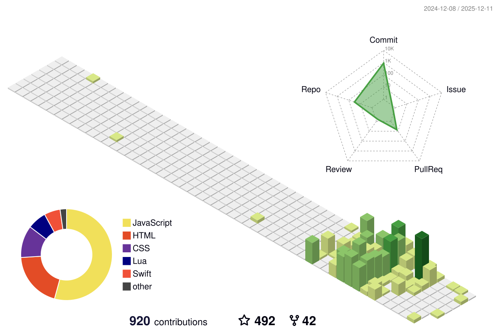

<!-- 打字特效 -->

  

<!-- 访客统计 -->

  

<!-- GitHub 统计卡片 -->

  
  

<!-- GitHub 连续打卡 -->

  

<!-- GitHub 活动统计图 -->

  

<!-- GitHub 资料奖杯 -->

  

<!-- 贪吃蛇动画 -->

  <picture>
    <source media="(prefers-color-scheme: dark)" srcset="https://raw.githubusercontent.com/iamcheyan/iamcheyan/output/github-contribution-grid-snake-dark.svg">
    <source media="(prefers-color-scheme: light)" srcset="https://raw.githubusercontent.com/iamcheyan/iamcheyan/output/github-contribution-grid-snake.svg">
    
  </picture>

<!-- Metrics 统计信息 -->

  

<!-- GitHub 3D 统计 -->

  

---

## 👋 关于我 / 私について

**徹言｜プログラマー・作家・脚本家**  
**澈言｜程序员・作家・编剧**

2009年からフルスタック開発に従事し、Python（Flask・PyWebIO・Streamlit）、JavaScript（ES6+）、MySQLなどの技術スタックを活用してまいりました。2014年に起業し、投資を獲得した経験があります。チームマネジメントやプロジェクト実行の豊富な経験を持ち、書籍出版や映像作品の脚本・制作にも携わるなど、多分野での協働経験を積んでまいりました。

自2009年起从事全栈开发，擅长使用 Python（Flask・PyWebIO・Streamlit）、JavaScript（ES6+）、MySQL 等技术栈。2014年创业并获得投资。拥有丰富的团队管理和项目执行经验，并参与书籍出版和影视作品的剧本创作与制作，积累了多领域的协作经验。

- 🔭 **現在の仕事 / 当前工作**: フルスタック開発、書籍執筆、脚本制作
- 🌱 **学習中 / 正在学习**: 日本語、自然言語処理、映像制作
- 💼 **経験 / 经验**: 2009年から開発開始、2014年創業・投資獲得
- 📚 **出版 / 出版**: 複数の書籍を出版、映像作品の脚本・制作に携わる
- 🎬 **映像作品 / 影视作品**: ドラマ・映画・ショートドラマの脚本・企画・制作

---

## 🛠️ 技术栈 / 技術スタック

### 编程语言 / プログラミング言語

### Python 框架 / Pythonフレームワーク

### 前端技术 / フロントエンド技術

### 数据库 / データベース

### 工具和平台

---

## 📊 GitHub 统计 / GitHub統計

<!-- 修仙系列统计卡片（可选） -->

  

---

## 🚀 プロジェクト / 项目

### 主要プロジェクト / 主要项目

#### Fudoki (2025)
日本語学習者や自然言語処理研究者向けの日本語テキスト分析ツール。  
面向日语学习者和自然语言处理研究者的日语文本分析工具。

#### Terebi (2025)
日本全国100以上のテレビ局の公開番組をオンラインで視聴可能。  
可在线观看日本全国100多个电视台的公开节目。

#### Kotoba (2024)
オンライン日本語単語暗記ツール。辞書切替や各種補助表示設定に対応。  
在线日语单词记忆工具。支持词典切换和各种辅助显示设置。

#### 7z-for-Linux (2024)
7z圧縮ソフトをLinuxに移植、ネイティブ7zコマンドラインツールも利用可能。  
将7z压缩软件移植到Linux，也可使用原生7z命令行工具。

#### OrchideaDock (2023)
Orchideaテーマから派生したテーマ。Cinnamon公式リポジトリに統合済み。  
从Orchidea主题派生的主题。已集成到Cinnamon官方仓库。

#### YRBOOK BAS (2021)
書籍業界向けに開発されたデータ検索ツール。  
为图书行业开发的数据检索工具。

#### Mir2EI2.0 (2021)
クラシックオンラインゲームの復刻版。オリジナルのプレイ方法を忠実に再現。  
经典在线游戏的复刻版。忠实再现原始玩法。

#### wenyue.cn (2014)
文悦科技（北京）有限公司、2014年設立。フォント設計・開発・販売に特化し、アリババから投資を受ける。  
文悦科技（北京）有限公司，2014年成立。专注于字体设计、开发和销售，获得阿里巴巴投资。

#### GANLINE Olive Media (2012)
ウェブサイト設計・開発に特化した会社。  
专注于网站设计和开发的公司。

#### VEIKIN (2007)
2007年8月29日創刊、オリジナルコンテンツを主とする電子雑誌。  
2007年8月29日创刊，以原创内容为主的电子杂志。

---

## 📚 出版物 / 出版物

### 個人作品 / 个人作品

- **他人の地図では自分の道は見つからない** (2020年4月)  
  台湾ムーグァン文化有限公司 / ISBN: 9789869942508

- **ブロックチェーン風雲** (2020年10月)  
  遼寧人民出版社 / ISBN: 9787205099527

- **人生の苦しみを嘆くな、それは世界を見る道だ** (2018年11月)  
  江蘇鳳凰文芸出版社 / ISBN: 9787559429100  
  オーディオ権はXimalayaに授権済み

- **エース起業家：風口ゲーム** (2018年2月)  
  百花洲文芸出版社 / ISBN: 9787550025387  
  映像権はiQIYIに授権済み / オーディオ権は北京人民ラジオ局に授権済み

- **この世界は変わらない人を忘れていく** (2017年5月)  
  北京連合出版公司 / ISBN: 9787559602404  
  オーディオ権はXimalayaに授権済み

### 共著作品 / 合著作品

- **世界はあなたのような人を罰している** (2018年3月)  
  中国法制出版社 / ISBN: 9787509391037  
  李尚龍らと共著

- **あなたが温かくなると天気も良くなる** (2017年10月)  
  江蘇鳳凰文芸出版社 / ISBN: 9787559409898  
  関熙潮らと共著

---

## 🎬 映像作品 / 影视作品

### ドラマ / 电视剧
- **劉老根5** (2022) - 脚本助手
- **劉老根4** (2021) - ストーリー企画
- **劉老根3** (2020) - ストーリー企画

### 映画 / 电影
- **波乱万丈3** (2021) - 脚本
- **波乱万丈2** (2021) - 脚本
- **波乱万丈** (2019) - ストーリー企画
- **明日再生** (2020) - プロデューサー助手
- **ミラーズ・明日青春** (2017) - 書籍全記録企画編集

### ショートドラマ / 短剧
- **eスポーツ天才の堕落カウントダウン** (2021) - 映像企画
- **私の人生はネタバレされた** (2021) - エグゼクティブプロデューサー
- **飛べるウサギ** (2021) - ストーリー企画
- **より大きな世界** (2021) - ストーリー企画
- **嘘** (2021) - ストーリー企画

### 書籍企画 / 书籍策划
- **愛と情熱、私たちを前進させる** (2019) - 企画編集

---

## 📝 最新ブログ記事 / 最新博客文章

<!-- BLOG-POST-LIST:START -->
<!-- BLOG-POST-LIST:END -->

---

## 📫 連絡先 / 联系方式

- 📧 **Email**: [me@iamcheyan.com](mailto:me@iamcheyan.com)
- 🌐 **Website**: [iamcheyan.com](https://iamcheyan.com)
- 🐦 **Twitter/X**: [@iamcheyan](https://x.com/iamcheyan)

---

## ⚡ 最近の活動 / 最近的活动

<!-- GitHub 活动统计图已在上方显示 / GitHub活動統計図は上記に表示されています -->

---

  

---

  
  
  
  

  
  
  

---

  
  © 2010 - 2025 Cheyan All Rights Reserved
  

